  

_Data Science @ IIT Madras · building real-time systems, dev tools &amp; full-stack web apps — somewhere among the stars_

---

### About me

- BS in Data Science &amp; Applications @ **IIT Madras**
- Currently building **A Meet** (full-stack video conferencing with my own SFU) and a **2D virtual-office metaverse**
- Freelancing — shipping production websites for real clients
- I love **real-time systems, developer tools, and space tech**
- Ask me about **Node/Express, Socket.IO, React, Vue, or deploying on AWS**
- Reach me at **rajasaikia1644@gmail.com**

---

### Tech Stack

**Languages**

**Frontend**

**Backend &amp; Realtime**

**Data &amp; Infra**

---

### Featured Projects

- **[Tales of Veridia](https://github.com/Anuraj-dev/pokemon)** — 3D creature-collecting RPG that runs fully in the browser, entirely procedural: sprites, world, and music generated in code, with a from-scratch battle engine and a unit-tested core. `Three.js · Web Audio`
- **[Student ERP](https://github.com/Anuraj-dev/student_erp)** — Flask ERP backend for an education department: admissions, fees, hostel &amp; library modules, JWT auth, a real-time SocketIO dashboard, and PDF + QR document generation, backed by a large pytest suite. `Flask · SocketIO · JWT · pytest`
- **[GoCareer](https://github.com/Anuraj-dev/GoCareer)** — AI career guidance for rural Indian students, powered by Gemini 2.0 Flash with an offline fallback dataset. `Express · Gemini 2.0 Flash`
- **[Khata](https://github.com/Anuraj-dev/Khata)** — Personal-finance PWA for India: auto-logs UPI spends from SMS, tracks *udhaar* by person, and splits trip expenses. `React 19 · Convex · Capacitor · Tailwind`
- **[AI Usage Monitor](https://github.com/Anuraj-dev/ai-usage-monitor)** — Local dashboard that tracks token usage and estimated cost across Claude Code, Codex, and OpenCode — no proxy or API key needed. `Python · FastAPI · SQLite`
- **[Sundarbans House](https://github.com/SundarbansWebOps/Frontend)** — Centralized platform for events, resources, and team collaboration for my IIT Madras BS student house. `Vue 3 · Vite`

---

### Connect

  
  <!-- Portfolio is being rebuilt — drop in the URL and uncomment once it's live:
  
  -->

The starfield above is generated nightly from my real GitHub activity — planets are my languages, the supernova is my busiest day, and "first light" is the day this account was born. <a href="./scripts/generate_space_telemetry.py">See how it's built →</a>
