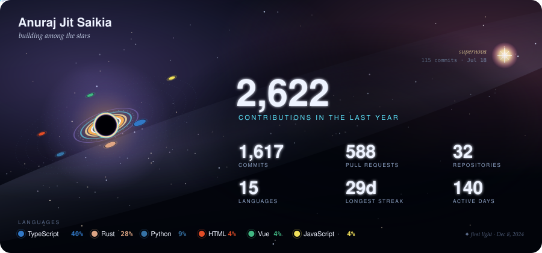

  

_Data Science @ IIT Madras · building real-time systems, dev tools &amp; full-stack web apps , somewhere among the stars_

---

### About me

I’m a software engineering student at IIT Madras building realtime systems and full-stack products.

I like working on video, voice, and collaboration tools, especially the systems that make them feel reliable and easy to use.

---

### Tech Stack

**Languages**

**Frontend**

**Backend &amp; Realtime**

**Data &amp; Infra**

---

### Featured Projects

- **[A-Meet](https://github.com/Anuraj-dev/A-Meet)** -  A video-conferencing platform built around a mediasoup SFU, with reconnect handling, live captions, scheduled meetings, and production observability.
- **[Voisu](https://github.com/Anuraj-dev/voisu)** -  A voice-first writing and transcription tool focused on turning spoken thoughts into reliable, usable text.
- **[2D Metaverse](https://github.com/Anuraj-dev/2d-metaverse)** - A virtual office with proximity audio, key-gated meeting rooms, seated video calls, and browser-based games.
- **[Khata](https://github.com/Anuraj-dev/Khata)** -  A personal-finance PWA for India that helps people track UPI spending, lending, trip expenses, and budgets.
---

### Connect

  
  

The starfield above is generated from my GitHub activity, a small signature from the work behind this profile. <a href="./scripts/generate_space_telemetry.py">See how it’s built →</a>
